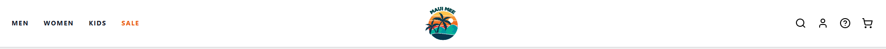
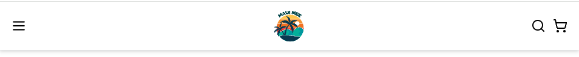
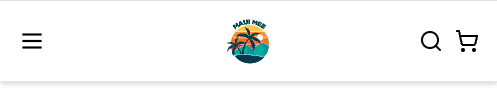

# Okinawa Mee

A react front end e-commerce project selling awesome Okinawa Kariyushi shirts. This project was inspired by my love for Okinawa and the shirts they wore. I have always liked Hawaiian shirts but noticed there wasn't any an ecommerce sites that sold Okinawa shirts. I thought this would be a great way to showcase Okinawa culture as well.

## 1. Install Dependencies and setup Project

The project was made in React Vite, Javascript SWC, Tailwind CSS. Remote and local Git repos were also initialized. React router dom, headless UI and Lucide react was installed.

## Project Planning

This is probably the most important. Planning the project and having pre-designs, page layouts, images/image references and mockups already in place exponentially increases the efficiency of the project.

What are the color schemes of the project?
Ideally the designer would have finished and prepared everything for you.

### Step 1 - Page Outlines

Create basic wireframes for each page

- Home Page

- Product Listing Page
- Product Detail Page
- Cart Page
- Checkout Page
- Navigation and Footer

### Step 2 - Components

- Navbar (used across all pages )
- Footer (used across all pages )
- Banner (home page only promotion)
- Product Details (used on Product Detail Page)
- Cart Item Card (for cart item)

### Step 3 - Routing

- use react-router-dom with `npm i react-router-dom`
- Define all Route in the App.jsx and wrap it in the Router
- Import all the Pages into the App.jsx and link each Route with a correct path and element. The element will be the Specific page

### Step 4 - Setting Up Folder Structure

This is just a preliminary.

src/
├── assets/ # Static assets
│ ├── images/ # All images
│ └── icons/ # Icon files
│
├── components/ # Reusable components
│ ├── layout/ # Layout components
│ │ ├── Header.jsx
│ │ ├── Footer.jsx
│ │ └── Navigation.jsx
│ │
│ ├── product/ # Product-related components
│ │ ├── ProductCard.jsx
│ │ ├── ProductGrid.jsx
│ │ └── ProductDetail.jsx
│ │
│ ├── cart/ # Cart components
│ │ ├── CartItem.jsx
│ │ └── CartSummary.jsx
│ │
│ └── ui/ # Common UI components
│ ├── Button.jsx
│ ├── Input.jsx
│ └── Card.jsx
│
├── pages/ # Page components
│ ├── Home.jsx
│ ├── ProductListing.jsx
│ ├── ProductDetail.jsx
│ ├── Cart.jsx
│ └── Checkout.jsx
│
├── context/ # React Context
│ └── CartContext.jsx
│
├── data/ # Mock data files
│ └── products.js # Product data
│
├── hooks/ # Custom hooks
│ └── useCart.js
│
├── utils/ # Helper functions
│ └── formatters.js
│
├── App.jsx
└── index.jsx

### Step 5 - Component Design

- Home Page:
  Add Header and Navigation (on all pages )
  Add a Banner component (e.g., "Shop Our Latest Shoes").
  Add a Product Category Section (links to different categories).

- Product Listing Page:
  Use a Product Card component to list products.
  Each Product Card includes an image, product name, and price.
  Clicking a product should navigate to the Product Detail Page (/products/:id).

- Product Detail Page:
  Show a larger product image, product details, price, and an "Add to Cart" button.

- Cart Page:
  Display Cart Items using a Cart Item Card component.
  Include buttons for "Remove" and "Proceed to Checkout."

- Checkout Page:
  Include a simple form to capture customer details (like name and email, just for demonstration).

### Step 6 - Building One Page at a Time

Building one page at a time will make things linear.
This will make it simple to do things.
Linear + Simple = RESULTS

1. Build Home Page
2. Move to Product Listing Page:
   Create ProductCard and display multiple products in a grid.
   Use sample data (JSON file or hardcoded array) to render products.
3. Proceed with the Product Detail Page, Cart Page, and Checkout Page, following similar steps.

### Step 7 - Add State Management

Use React Context API for simple global state management.
For Version 2 make it in Redux for Enterprise Level Scalability.

### Step 8 - Testing

1. Run test between navigation between pages
2. Run test to verify Add to Cart works and item appears in the cart.
3. Run tests for responsivenssess.
4. Run tests for links.
5. Run tests for security.

Day #1 - Finished the Header Layout and Mobile Responsiveness.





TroubleShooting -

Day #2 - Footer Finished

TroubleShooting

- How do I get the fonts to be universal in Tailwind?
  Solution: Import font via url, add it in App.css file and update in tailwind.config extend key property object like the following:  
   `    fontFamily: {
  inter: ["Inter", "sans-serif"],
  poppins: ["Poppins", "sans-serif"],
},.`

- Add new @layer base to the index.css to style h1, h2, h3, p, button etc..
- We can also add component stylings here for example we have three different button versions.
- We added some basic button colors and hover states.

```
@layer components {
  .btn-primary {
    @apply font-inter font-medium px-4 py-2 bg-primary text-white rounded-md
    hover:bg:btn-secondary transition-colors;
  }

  .btn-secondary {
    @apply font-inter font-meidium px-4 py-2 bg-secondary text-white rounded-md
    hover:bg:btn-secondary transition-colors;
  }
  .btn-outline {
    @apply font-inter font-medium px-4 py-2 text-white rounded-md
    hover:bg:btn-secondary transition-colors;
  }
}
```

Day #3 - Hero Banner Finished, Values Component Finished, Subscriber Component Finished

The main part of the hero banner and its reponsiveness was completed today.
However the buttons are not working nor does it link anywhere.

Values Component Finished.

Subscriber Component Finished - Had trouble with the ring outline in tailwind.
Solution: border
transition-all ease-in-out
font-bold
focus:border-customFooterBackground
focus:ring-1 focus:ring-customFooterBackground

Day #4, 5, 6 - Main Collections Banner,

This section will hard.
There are few things to make.

1. A resuable carousel component for the main collections and bento grid for medium screens and smaller. The Carousel is scrollable by mouse and hand drag.
2. Setup dummy data for both main collections and bento grid.
3. Think about the entire data for the products to build and where to store the data. Will it be here in my react project or do we use a headless CMS like Sanity to store and update all the data.

Problems- Each column is measured at 600x800 but why does it overflow the parent container?

Solution: Change it to h-[calc(100vh)]. Previously it was set at h-[calc(100vh - 80px)] hence the overlap.

Issues left:
Problems-on Mobile devices how to setup the slider carousel. Oh boy....

Issues left:
Problem: I want the container of images to shrink with the parent container until it hits 992px

Solution:

- In the parent container i got rid of the h-[calc(100vh)]. The first child container is now set to h-full so it takes up 100% height of the parent container. This solved the issue of child elements shrinking and growing in proportion to screen size 992px and above.
- In the third child container deleted `max-h-[830px] h-full max-h-[830px]` to `h-fit`. This will instead the height will shrink or expand based on its content.

Day 5 - Main Collections Carousel Drag and Slide Functionality, Bento Grid Carousel Outline

Problem - On small devices in the main collection section the height is taking up more space than the screen viewport for screen sizes below 1024px. I want to only take up 100% of the available screen size.

Solution - This one was hard. Had to research. Added below Tailwind code.
`md:h-[calc(100vh-theme(spacing.32))]`

theme(spacing.32): references a predefined spacing value. spacing.32 corresponds to a spacing unit in Tailwind's spacing scale, which defaults to 8rem or 128px.

Problem - I want to get rid of the horizontal scrollbar when screen size is below 1024px.

Solutions - Delete overflow-x-auto. However this has caused another issue. See below

Problem - The scrollbar is still showing despite fixing the mobile responsiveness.

Solution - Had to install a package called `npm install tailwind-scrollbar-hide`. Created a new file in `src > types.d.ts`. Added `declare module 'tailwind-scrollbar-hide' {
    const plugin: any;
    export default plugin;
}`
In tailwind.config.js added: `import scrollbarHide from 'tailwind-scrollbar-hide' plugins: [scrollbarHide],`

Hmm...seems like the below was a better solution.

```
html,
body {
  margin: 0;
  padding: 0;
  min-height: 100vh;
  overflow-y: auto; /* Allows vertical scrolling and shows vertical scrollbar */
  overflow-x: hidden; /* Allow horizontal scrolling */
}
```

Problem - Adding slide and drag functionality
Solution - Add three handle functions start, move, end.
One of the hard things was the tailwind classes.
`cursor-grab active:cursor-grabbing touch-pan-x`

```
<div
            className='flex gap-2 flex-row w-full overflow-x-auto cursor-grab active:cursor-grabbing touch-pan-x'
            style={{
              scrollBehavior: isDragging ? "auto" : "smooth",
              scrollbarWidth: "none" /* Firefox */,
              msOverflowStyle: "none" /* IE and Edge */,
              WebkitOverflowScrolling: "touch",
              "&::-webkit-scrollbar": {
                display: "none" /* Chrome, Safari and Opera */,
              },
            }}
            ref={sliderRef}
            onMouseDown={handleDragStart}
            onMouseMove={handleDragMove}
            onMouseUp={handleDragEnd}
            onMouseLeave={handleDragEnd}
            onTouchStart={handleDragStart}
            onTouchMove={handleDragMove}
            onTouchEnd={handleDragEnd}
          >

```

Problem - I want the slider to be infinite, meaning i want it to loop itself infinitely.

Solution:
Things we need to track

1. Current scroll position
2. Width of each slide
3. Total width of all slides
4. When we reached the start or end

Concepts to Implement
When user scrolls right and reaches end that means content going left:

- We need duplicate of first items at the end
- When we reach this duplicate we need to
- Instantly or invisibly move them back to the real first items

When user scrolls left and reaches end:

- We need a duplicate of last items at the start
- When they reach these duplicates
- We need to instantly move them to the real last items

Key Steps
a. Data Structure

- How should we modify our items array?
- How many items should we duplicate?

b. Scroll Position Detection

- How do we know when user has reached duplicated items?
- What scroll position triggers our "loop"?

c. Smooth Transition

- How do we make the position reset invisible to user?
- How do we prevent flickering?

` Visual Diagram`
[C, A, B, C, A]
^ ^ ^
| | |
| Real |
Duplicate Duplicate

` Right Scroll`
[C, A, B, C, A]
➡️ ➡️ ➡️

When user reaches the duplicate 'C':
[C, A, B, C, A]
↩️
Instantly jump back to the real 'C'

` left Scroll`
[C, A, B, C, A]
⬅️ ⬅️ ⬅️

When user reaches the duplicate 'C':
[C, A, B, C, A]
↪️
Instantly jump to the real 'C'

User never notices the "jump" because the duplicated items look identical
We need to detect when user reaches these duplicate sections
We instantly reset their position to the corresponding real section

Update the MainCollections collections array with the first and last item copied into a new array. Pass this as a new prop value in the MainCollections component.

```
 const createInfiniteItems = (items) => {
    // Get copy of last item in the array
    const lastItem = items[items.length - 1];
    // Get copy of first item in the array
    const firstItem = items[0];

    // return new array with cloned item at start and end
    return [lastItem, ...items, firstItem];
  };

  // create infinite collections
  const infiniteCollections = createInfiniteItems(collections);
```

Now we need to know when the user reaches the cloned items. We need to know two things:

- When user reaches the first clone (the duplicate last item)
- When user reaches the last clone (the duplicate first item)

create a new function called checkscrollPosition. We also need to use the sliderRef.

- this will check our scrollWidth (entire carousel including the not visible parts), clientWidth (the view port only), currentScroll (which is the horizontal position from the left edge of the container)
- now that we have these values implement logic to detect when we have reached our cloned items and need to loop back.
- we need to start on the real item 1 first.
- create a handleInfiniteScroll function
- make a cleanup function with useEffect for the handleInfiniteScroll
- Add a smooth-scroll to the className and scrollSnapType x mandatory for the style
- On the Actual Product Div we added scrollSnapAlign: "center" to the style attribute
- Second issue is when scrolling to the clone
- Had to split the items array one for desktop and one for Mobile that has clones. desktop uses the slice method to only have the origianl non cloned items.

Problem - On Hover for Each Collection Column I want the card to show the button and scale the background image slightly.
Solution

taking a break from this functionality. We spend too long on this. Will come back later for the final hover issue.

Day #7 Value Banner and Bento Grid
Value Banner finished.
May need to adjust picture
Started on Bento Grid

Day #8
Got the outline of Bento Grid.
Had trouble on the Mobile screen of the column grid. The products data wasnt being passed to the Mobile Slider. A lot of errors. It was saying an invalid data type.
Solution: const MobileSlider = (products) => {} We needed to object destructure.
MobileSlider.propTypes = {
products: PropTypes.arrayOf(PropTypes.object).isRequired,
};

Doing propType checks would have helped fix the issue earlier.

Day #9

- Completed the Layout and Responsiveness of the Bento Collection.
- Started half of the functionality of the mobile scroll

Day #10 Complete Scrolling Functionality

- Finally finished the Infinite Scroll Carousel,
- This was very hard. Needed a lot of research and help
- Took at least 4 days.
- Understanding the logic  of the handleScroll
  ```
  
  
  ```


Day #11 Day off

Day #12 Day off

Day #13 
- Trying to understand the logic behind the infinite scroll functionality. 

Day #14
- Start on More to Shop Collections
- Setting up Page Routes
  


